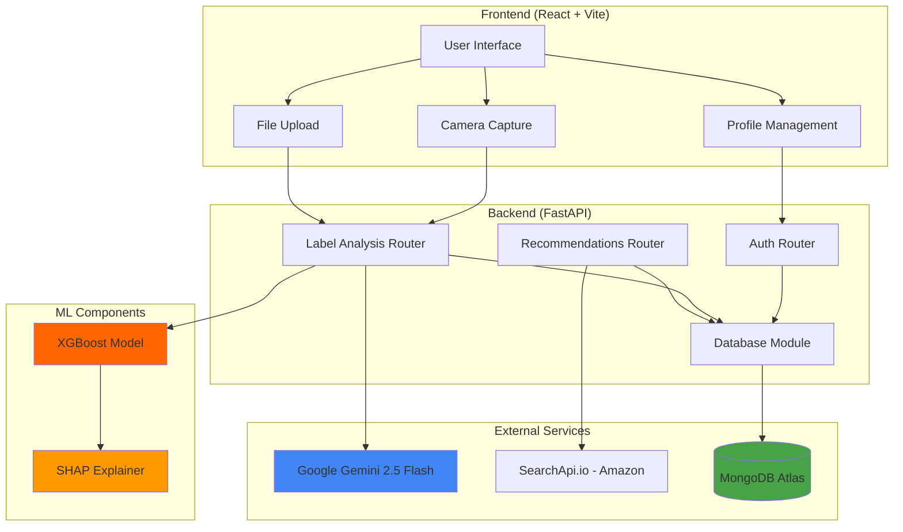

# 🔬 Nutrilens - Complete Reverse Engineering Report

## Executive Summary

This report provides a comprehensive analysis of the **Nutrilens** codebase, documenting what is **actually implemented** versus what is claimed or planned. The analysis is based on executable code only, not documentation or comments.

---

# 1. High-Level Overview

## Purpose
Nutrilens is a web application that analyzes food product labels using AI vision technology to identify potential health risks, allergens, and toxicological concerns.

## Problem It Solves
- Helps users understand ingredient risks in packaged food products
- Identifies allergens that match user's personal allergen profile
- Provides personalized health risk assessments based on user health conditions
- Recommends safer product alternatives from Amazon

## End-to-End Workflow

1. **User Registration**: User signs up with optional allergen profile and health data (age, BMI, diabetes, heart disease, hypertension)
2. **Authentication**: User signs in to access personalized features
3. **Image Capture**: User captures or uploads a product label image
4. **AI Analysis**: Image is sent to Google Gemini 2.5 Flash Vision model
5. **Risk Prediction**: XGBoost ML model predicts risk level using nutrition data and user health profile
6. **SHAP Explanation**: SHAP values explain which features contributed to the risk score
7. **Report Generation**: Comprehensive toxicology report with allergen warnings
8. **Purchase Tracking**: User can mark products as purchased for history
9. **Recommendations**: Amazon product search via SearchApi.io for safer alternatives

---

# 2. Architecture

## Complete System Architecture



## Technology Stack

### Frontend
- **React 19.1.1** - UI framework
- **React Router DOM 7.9.4** - Client-side routing
- **React Webcam 7.2.0** - Camera integration
- **Chart.js 4.5.1** - SHAP visualization charts
- **React-Chartjs-2 5.3.1** - React wrapper for Chart.js
- **Vite 7.1.7** - Build tool and dev server

### Backend
- **FastAPI 0.119.0** - Web framework
- **Uvicorn 0.37.0** - ASGI server
- **PyMongo 4.6.0** - MongoDB driver
- **Bcrypt 4.3.0** - Password hashing
- **Google Generative AI 0.8.3** - Gemini API client
- **HTTPX 0.28.1** - Async HTTP client for SearchApi
- **Pillow 10.4.0** - Image processing

### AI/ML
- **Google Gemini 2.5 Flash** - Vision language model for label OCR and analysis
- **XGBoost 3.2.0** - Gradient boosting model for risk prediction
- **SHAP 0.51.0** - Model explainability
- **Joblib 1.5.3** - Model serialization

### Database
- **MongoDB Atlas** - Cloud NoSQL database

### External APIs
- **SearchApi.io** - Amazon product search API

---

# 3. Implemented Features

## :white_check_mark: Fully Implemented

### Authentication System
**Description**: Complete user authentication with bcrypt password hashing  
**Files**: [`backend/src/routers/auth.py`](backend/src/routers/auth.py:1)  
**Evidence**:
- Signup endpoint with password hashing: [`auth.py:33-62`](backend/src/routers/auth.py:33-62)
- Signin with bcrypt verification: [`auth.py:64-83`](backend/src/routers/auth.py:64-83)
- Profile retrieval: [`auth.py:85-104`](backend/src/routers/auth.py:85-104)
- Profile update: [`auth.py:106-149`](backend/src/routers/auth.py:106-149)

### User Health Profile Management
**Description**: Stores and manages user health data for personalized risk assessment  
**Files**: [`backend/src/routers/auth.py`](backend/src/routers/auth.py:1), [`frontend/src/pages/signup.jsx`](frontend/src/pages/signup.jsx:1), [`frontend/src/pages/profile.jsx`](frontend/src/pages/profile.jsx:1)  
**Evidence**:
- Health fields in signup: age, BMI, diabetes, heart_disease, hypertension [`auth.py:18-22`](backend/src/routers/auth.py:18-22)
- BMI calculation in frontend: [`signup.jsx:34-48`](frontend/src/pages/signup.jsx:34-48)
- Health profile update: [`auth.py:119-128`](backend/src/routers/auth.py:119-128)

### Allergen Profile System
**Description**: Users can set personal allergens; system warns when detected in products  
**Files**: [`backend/src/routers/auth.py`](backend/src/routers/auth.py:1), [`backend/src/routers/label.py`](backend/src/routers/label.py:1), [`frontend/src/pages/signup.jsx`](frontend/src/pages/signup.jsx:1)  
**Evidence**:
- Allergen storage in user document: [`auth.py:48`](backend/src/routers/auth.py:48)
- Allergen detection in Gemini prompt: [`label.py:16-26`](backend/src/routers/label.py:16-26)
- User allergen warning in response: [`label.py:66`](backend/src/routers/label.py:66)
- Frontend allergen selection: [`signup.jsx:59-76`](frontend/src/pages/signup.jsx:59-76)

### AI-Powered Label Analysis (Gemini Vision)
**Description**: Uses Google Gemini 2.5 Flash to extract ingredients, allergens, and nutrition from images  
**Files**: [`backend/src/routers/label.py`](backend/src/routers/label.py:1)  
**Evidence**:
- Gemini model initialization: [`label.py:14-115`](backend/src/routers/label.py:14-115)
- Image processing with PIL: [`label.py:118-120`](backend/src/routers/label.py:118-120)
- Structured JSON prompt: [`label.py:47-69`](backend/src/routers/label.py:47-69)
- Response parsing: [`label.py:129-180`](backend/src/routers/label.py:129-180)

### XGBoost Risk Prediction Model
**Description**: Machine learning model predicts risk level (safe/moderate/severe) based on nutrition and health data  
**Files**: [`backend/src/services/model.py`](backend/src/services/model.py:1), [`backend/src/routers/label.py`](backend/src/routers/label.py:1)  
**Evidence**:
- Model loading: [`model.py:21-32`](backend/src/services/model.py:21-32)
- Feature vector construction: [`label.py:157-168`](backend/src/routers/label.py:157-168)
- Risk prediction: [`label.py:171-176`](backend/src/routers/label.py:171-176)
- Risk categories: safe, moderate_risk, severe_risk [`model.py:57`](backend/src/services/model.py:57)

### SHAP Explainability
**Description**: Provides interpretable explanations for ML model predictions  
**Files**: [`backend/src/services/model.py`](backend/src/services/model.py:1), [`frontend/src/components/ShapChart.jsx`](frontend/src/components/ShapChart.jsx:1)  
**Evidence**:
- SHAP TreeExplainer initialization: [`model.py:27`](backend/src/services/model.py:27)
- SHAP value calculation: [`model.py:78-108`](backend/src/services/model.py:78-108)
- Feature impact extraction: [`model.py:98-105`](backend/src/services/model.py:98-105)
- Frontend visualization with Chart.js: [`ShapChart.jsx:19-74`](frontend/src/components/ShapChart.jsx:19-74)

### Camera Capture & File Upload
**Description**: Dual input methods for product label images  
**Files**: [`frontend/src/components/CameraCapture.jsx`](frontend/src/components/CameraCapture.jsx:1), [`frontend/src/pages/home.jsx`](frontend/src/pages/home.jsx:1)  
**Evidence**:
- React Webcam integration: [`CameraCapture.jsx:18-24`](frontend/src/components/CameraCapture.jsx:18-24)
- File upload with validation: [`home.jsx:82-110`](frontend/src/pages/home.jsx:82-110)
- Input method toggle: [`home.jsx:236-250`](frontend/src/pages/home.jsx:236-250)

### Purchase History Tracking
**Description**: Users can mark products as purchased and view history  
**Files**: [`backend/src/routers/recommendations.py`](backend/src/routers/recommendations.py:1), [`frontend/src/pages/profile.jsx`](frontend/src/pages/profile.jsx:1)  
**Evidence**:
- Purchase endpoint: [`recommendations.py:46-75`](backend/src/routers/recommendations.py:46-75)
- History retrieval: [`recommendations.py:77-100`](backend/src/routers/recommendations.py:77-100)
- Delete purchase: [`recommendations.py:102-148`](backend/src/routers/recommendations.py:102-148)
- Frontend integration: [`home.jsx:119-150`](frontend/src/pages/home.jsx:119-150)

### Amazon Product Recommendations (SearchApi.io)
**Description**: Real Amazon product search with allergen filtering  
**Files**: [`backend/src/services/amazon_search.py`](backend/src/services/amazon_search.py:1), [`backend/src/routers/recommendations.py`](backend/src/routers/recommendations.py:1)  
**Evidence**:
- SearchApi integration: [`amazon_search.py:12-228`](backend/src/services/amazon_search.py:12-228)
- Product search with allergen exclusion: [`amazon_search.py:24-84`](backend/src/services/amazon_search.py:24-84)
- Allergen filtering: [`amazon_search.py:139-159`](backend/src/services/amazon_search.py:139-159)
- Recommendation endpoint: [`recommendations.py:150-224`](backend/src/routers/recommendations.py:150-224)

### MongoDB Database Integration
**Description**: NoSQL database for user data and purchase history  
**Files**: [`backend/src/database.py`](backend/src/database.py:1)  
**Evidence**:
- MongoDB client with SSL: [`database.py:10-14`](backend/src/database.py:10-14)
- Collections: users, purchases [`database.py:17-18`](backend/src/database.py:17-18)
- Connection test: [`database.py:21-25`](backend/src/database.py:21-25)

### Responsive UI with React Router
**Description**: Multi-page React application with navigation  
**Files**: [`frontend/src/App.jsx`](frontend/src/App.jsx:1), [`frontend/src/components/Navbar.jsx`](frontend/src/components/Navbar.jsx:1)  
**Evidence**:
- Route configuration: [`App.jsx:12-17`](frontend/src/App.jsx:12-17)
- Pages: Home, SignIn, SignUp, Profile
- Navigation bar component

## :construction: Partially Implemented

### Tavily Web Search
**Description**: Legacy web search API mentioned in requirements but not actively used  
**Files**: [`requirements.txt`](requirements.txt:28)  
**Evidence**:
- Package installed: `tavily-python==0.5.0` [`requirements.txt:28`](requirements.txt:28)
- **NOT imported or used** in any backend code
- Replaced by SearchApi.io for Amazon search

## :x: Planned But Not Implemented

### Graph Neural Networks (GNN)
**Status**: NOT IMPLEMENTED  
**Evidence**: No GNN code exists. No graph structures, no PyTorch Geometric, no node embeddings.

### FoodOn Ontology Integration
**Status**: NOT IMPLEMENTED  
**Evidence**: No ontology files, no SPARQL queries, no semantic reasoning code.

### RAG (Retrieval Augmented Generation)
**Status**: NOT IMPLEMENTED  
**Evidence**: No vector database, no embeddings, no retrieval mechanism.

### Traditional OCR (Tesseract/pytesseract)
**Status**: NOT IMPLEMENTED (except test file)  
**Evidence**: 
- Test file exists: [`backend/test/ocrTest.py`](backend/test/ocrTest.py:1)
- Uses pytesseract and OpenCV for camera capture
- **NOT used in production** - Gemini Vision handles OCR

### Google Cloud Vision API
**Status**: NOT IMPLEMENTED  
**Evidence**: 
- Package installed: `google-cloud-vision==3.8.1` [`requirements.txt:22`](requirements.txt:22)
- **NOT imported or used** anywhere in codebase
- Gemini Vision is used instead

### Collaborative Filtering
**Status**: NOT IMPLEMENTED  
**Evidence**: No user-item matrices, no similarity calculations, no recommendation algorithms beyond simple search.

### JWT Authentication
**Status**: NOT IMPLEMENTED  
**Evidence**: Uses localStorage for session management, no JWT tokens, no refresh tokens.

### PDF Export
**Status**: NOT IMPLEMENTED  
**Evidence**: No PDF generation libraries or code.

### Multi-language Support
**Status**: NOT IMPLEMENTED  
**Evidence**: All text is hardcoded in English.

---

# 4. AI Components

## Google Gemini 2.5 Flash (Vision Language Model)

**Model**: `gemini-2.5-flash`  
**Location**: [`backend/src/routers/label.py:115`](backend/src/routers/label.py:115)  
**Purpose**: Extract structured data from product label images

**Prompt Structure**:
```python
# System prompt with user allergens
system_prompt = get_system_prompt(user_allergens)
# Image + prompt sent to model
response = model.generate_content([system_prompt, image])
```

**Input**: 
- Product label image (JPEG/PNG)
- User's allergen list (optional)

**Output** (JSON):
```json
{
  "product_name": "string",
  "ingredients": ["list"],
  "nutrition": {
    "sugars": float,
    "kcal": float,
    "sodium": float,
    "saturated_fats": float
  },
  "toxicology_risks": [
    {
      "ingredient": "string",
      "risk_level": "low|medium|high",
      "description": "string",
      "alternatives": ["list"]
    }
  ],
  "allergens": ["list"],
  "user_allergens_detected": ["list"],
  "confidence": "low|medium|high",
  "summary": "string"
}
```

**Functionality**: ✅ FULLY FUNCTIONAL  
**Evidence**: [`label.py:76-197`](backend/src/routers/label.py:76-197)

## XGBoost Risk Prediction Model

**Model Type**: XGBoost Classifier  
**Location**: [`backend/src/services/model.py`](backend/src/services/model.py:1)  
**Model File**: `backend/src/services/models/nutrilens_xgb_model.pkl`

**Features** (10 total):
1. age
2. bmi
3. sugars
4. kcal
5. sodium
6. saturated_fats
7. diabetes (binary)
8. heart_disease (binary)
9. hypertension (binary)
10. allergen_match_count

**Input**: Feature dictionary from Gemini output + user health profile  
**Output**: 
- `risk_level`: 0, 1, or 2
- `risk_category`: "safe", "moderate_risk", "severe_risk"
- `shap_values`: List of feature impacts

**Functionality**: ✅ FULLY FUNCTIONAL (if model file exists)  
**Evidence**: [`model.py:34-76`](backend/src/services/model.py:34-76)

## SHAP (SHapley Additive exPlanations)

**Library**: `shap==0.51.0`  
**Explainer**: TreeExplainer for XGBoost  
**Location**: [`backend/src/services/model.py:27`](backend/src/services/model.py:27)

**Purpose**: Explain which features increased or decreased risk score

**Output Format**:
```json
{
  "feature": "Sugars",
  "value": 25.0,
  "impact": 0.45
}
```

**Visualization**: Bar chart showing positive (red) and negative (green) impacts  
**Frontend**: [`frontend/src/components/ShapChart.jsx`](frontend/src/components/ShapChart.jsx:1)

**Functionality**: ✅ FULLY FUNCTIONAL  
**Evidence**: [`model.py:78-108`](backend/src/services/model.py:78-108), [`ShapChart.jsx:19-74`](frontend/src/components/ShapChart.jsx:19-74)

## SearchApi.io (Amazon Product Search)

**Service**: Amazon product search API  
**Location**: [`backend/src/services/amazon_search.py`](backend/src/services/amazon_search.py:1)  
**API Endpoint**: `https://www.searchapi.io/api/v1/search`

**Input**:
- Search query (e.g., "healthy snack alternative organic")
- Allergen exclusions
- Department filter (default: "grocery")

**Output**: List of Amazon products with:
- Title, ASIN, price, rating
- Thumbnail image
- Prime eligibility
- Direct Amazon link

**Allergen Filtering**: Excludes products containing user allergens in title/description  
**Evidence**: [`amazon_search.py:139-159`](backend/src/services/amazon_search.py:139-159)

**Functionality**: ✅ FULLY FUNCTIONAL (if API key configured)  
**Evidence**: [`amazon_search.py:24-84`](backend/src/services/amazon_search.py:24-84)

---

# 5. Database Usage

## MongoDB

**Type**: NoSQL Document Database  
**Hosting**: MongoDB Atlas (cloud)  
**Connection**: [`backend/src/database.py:10-14`](backend/src/database.py:10-14)

### Database: `nutrilens`

### Collection: `users`

**Purpose**: Store user accounts and profiles

**Schema**:
```javascript
{
  _id: ObjectId,
  username: String (unique),
  password: Binary (bcrypt hash),
  name: String,
  allergens: [String],
  age: Number,
  bmi: Number,
  diabetes: Boolean,
  heart_disease: Boolean,
  hypertension: Boolean
}
```

**Queries**:
- Find by username: [`auth.py:36`](backend/src/routers/auth.py:36)
- Insert user: [`auth.py:56`](backend/src/routers/auth.py:56)
- Update profile: [`auth.py:134-137`](backend/src/routers/auth.py:134-137)

### Collection: `purchases`

**Purpose**: Track user purchase history

**Schema**:
```javascript
{
  _id: ObjectId,
  username: String,
  product_name: String,
  analysis_data: Object,
  image_url: String,
  purchased_at: DateTime,
  allergens: [String],
  ingredients: [String],
  toxicology_risks: [Object]
}
```

**Queries**:
- Insert purchase: [`recommendations.py:69`](backend/src/routers/recommendations.py:69)
- Find by username (sorted): [`recommendations.py:87-89`](backend/src/routers/recommendations.py:87-89)
- Delete by ID: [`recommendations.py:130-133`](backend/src/routers/recommendations.py:130-133)

**Indexes**: None explicitly defined (uses default _id index)

---

# 6. API Endpoints

## Authentication Endpoints (`/auth`)

| Route | Method | Purpose | Request Body | Response |
|-------|--------|---------|--------------|----------|
| `/auth/signup` | POST | Create account | `{username, password, name?, allergens?, age?, bmi?, diabetes?, heart_disease?, hypertension?}` | `{message, username, name}` |
| `/auth/signin` | POST | Sign in | `{username, password}` | `{message, username, name, allergens, age, bmi, diabetes, heart_disease, hypertension}` |
| `/auth/profile/{username}` | GET | Get profile | - | `{username, name, allergens, age, bmi, diabetes, heart_disease, hypertension}` |
| `/auth/profile/{username}` | PUT | Update profile | `{name?, allergens?, age?, bmi?, diabetes?, heart_disease?, hypertension?}` | `{message, username, name, allergens, ...}` |
| `/auth/test` | GET | Test endpoint | - | `{message}` |

## Label Analysis Endpoints (`/api/v1/label`)

| Route | Method | Purpose | Request Body | Response |
|-------|--------|---------|--------------|----------|
| `/api/v1/label/analyze` | POST | Analyze label image | `file: UploadFile, username?: string` | `{product_name, ingredients, nutrition, toxicology_risks, allergens, user_allergens_detected, confidence, summary, risk_prediction?, user_allergens}` |
| `/api/v1/label/health` | GET | Health check | - | `{status, service, model}` |

## Recommendations Endpoints (`/api/v1/recommendations`)

| Route | Method | Purpose | Request Body | Response |
|-------|--------|---------|--------------|----------|
| `/api/v1/recommendations/purchase` | POST | Mark as purchased | `{username, product_name, analysis_data, image_url?}` | `{message, purchase_id, product_name}` |
| `/api/v1/recommendations/history/{username}` | GET | Get purchase history | `limit?: int` | `{username, total_purchases, purchases: [...]}` |
| `/api/v1/recommendations/purchase/{purchase_id}` | DELETE | Delete purchase | `username: query param` | `{message, purchase_id}` |
| `/api/v1/recommendations/suggest` | POST | Get recommendations | `{username, current_product?, limit?}` | `{username, user_allergens, excluded_allergens, search_query, recommendations: [...], total_found, based_on_purchases, source}` |
| `/api/v1/recommendations/health` | GET | Health check | - | `{status, service, amazon_search_available}` |

---

# 7. End-to-End Execution Flow

## Complete User Journey: Upload → Analysis → Recommendations

### Step 1: Frontend - Image Capture
**File**: [`frontend/src/pages/home.jsx:19-68`](frontend/src/pages/home.jsx:19-68)

1. User captures image via webcam OR uploads file
2. Image converted to blob
3. FormData created with image file
4. Username retrieved from localStorage

### Step 2: Backend - Receive Request
**File**: [`backend/src/routers/label.py:76-90`](backend/src/routers/label.py:76-90)

1. FastAPI receives POST to `/api/v1/label/analyze`
2. Validates image file type
3. Reads image bytes
4. Retrieves user data from MongoDB if username provided

### Step 3: User Profile Lookup
**File**: [`backend/src/routers/label.py:92-111`](backend/src/routers/label.py:92-111)

1. Query MongoDB `users` collection
2. Extract: allergens, age, BMI, diabetes, heart_disease, hypertension
3. Build user health profile dictionary

### Step 4: Gemini Vision Analysis
**File**: [`backend/src/routers/label.py:113-143`](backend/src/routers/label.py:113-143)

1. Initialize Gemini 2.5 Flash model
2. Convert image bytes to PIL Image
3. Generate system prompt with user allergens
4. Send [prompt + image] to Gemini
5. Receive structured JSON response

### Step 5: Parse Gemini Response
**File**: [`backend/src/routers/label.py:129-180`](backend/src/routers/label.py:129-180)

1. Clean response text (remove markdown)
2. Parse JSON
3. Extract: product_name, ingredients, nutrition, toxicology_risks, allergens, user_allergens_detected

### Step 6: Build ML Feature Vector
**File**: [`backend/src/routers/label.py:145-168`](backend/src/routers/label.py:145-168)

1. Extract nutrition: sugars, kcal, sodium, saturated_fats
2. Count matched allergens
3. Combine with user health data
4. Create 10-feature vector

### Step 7: XGBoost Risk Prediction
**File**: [`backend/src/services/model.py:34-76`](backend/src/services/model.py:34-76)

1. Load pre-trained XGBoost model
2. Sanitize input features
3. Predict risk level (0=safe, 1=moderate, 2=severe)
4. Map to risk category

### Step 8: SHAP Explanation
**File**: [`backend/src/services/model.py:78-108`](backend/src/services/model.py:78-108)

1. Initialize SHAP TreeExplainer
2. Calculate SHAP values for prediction
3. Extract feature impacts
4. Sort by absolute impact
5. Return top contributing features

### Step 9: Response to Frontend
**File**: [`backend/src/routers/label.py:172-180`](backend/src/routers/label.py:172-180)

1. Combine all analysis data
2. Add risk_prediction with SHAP values
3. Add user_allergens for frontend highlighting
4. Return JSON response

### Step 10: Frontend - Display Report
**File**: [`frontend/src/pages/home.jsx:304-469`](frontend/src/pages/home.jsx:304-469)

1. Receive analysis data
2. Display product name
3. Show risk prediction with color coding
4. Render SHAP chart (Chart.js bar chart)
5. **CRITICAL WARNING** if user allergens detected
6. List all allergens
7. Show toxicology risks with alternatives
8. Display ingredients list

### Step 11: Mark as Purchased (Optional)
**File**: [`frontend/src/pages/home.jsx:119-150`](frontend/src/pages/home.jsx:119-150)

1. User clicks "Mark as Purchased"
2. POST to `/api/v1/recommendations/purchase`
3. Store in MongoDB `purchases` collection
4. Show success message

### Step 12: Get Recommendations (Optional)
**File**: [`frontend/src/pages/home.jsx:152-185`](frontend/src/pages/home.jsx:152-185)

1. User clicks "Get Safer Alternatives"
2. POST to `/api/v1/recommendations/suggest`
3. Backend queries SearchApi.io for Amazon products
4. Filter out products with user allergens
5. Return list of safer alternatives

### Step 13: Amazon Product Search
**File**: [`backend/src/services/amazon_search.py:24-84`](backend/src/services/amazon_search.py:24-84)

1. Build search query: "healthy {product} alternative organic"
2. Add negative keywords for allergens
3. Call SearchApi.io API
4. Parse organic results
5. Filter by allergen content in title/description
6. Return top N products

### Step 14: Display Recommendations
**File**: [`frontend/src/pages/home.jsx:473-550`](frontend/src/pages/home.jsx:473-550)

1. Show Amazon product cards
2. Display: image, title, price, rating
3. Show Prime badge if eligible
4. Provide "Buy on Amazon" link
5. Explain why recommended (allergen-free, highly rated)

---

# 8. Reality Check

| Claimed Feature | Actually Exists? | Evidence |
|----------------|------------------|----------|
| **Graph Neural Networks** | ❌ NO | No GNN code, no graph structures, no PyTorch Geometric |
| **SHAP Explainability** | ✅ YES | [`model.py:27`](backend/src/services/model.py:27), [`ShapChart.jsx`](frontend/src/components/ShapChart.jsx:1) |
| **Eco-impact scoring** | ❌ NO | No environmental impact calculations |
| **FoodOn ontology** | ❌ NO | No ontology files, no semantic reasoning |
| **RAG** | ❌ NO | No vector database, no embeddings, no retrieval |
| **OCR (Tesseract)** | ❌ NO (production) | Test file only [`ocrTest.py`](backend/test/ocrTest.py:1), Gemini handles OCR |
| **Recommendation engine** | ✅ YES (basic) | Amazon search via SearchApi.io [`amazon_search.py`](backend/src/services/amazon_search.py:1) |
| **Personalized health analysis** | ✅ YES | XGBoost model with health features [`model.py`](backend/src/services/model.py:1) |
| **Gemini Vision** | ✅ YES | [`label.py:115`](backend/src/routers/label.py:115) |
| **XGBoost ML Model** | ✅ YES | [`model.py:26`](backend/src/services/model.py:26) |
| **Allergen Detection** | ✅ YES | User-specific warnings [`label.py:16-26`](backend/src/routers/label.py:16-26) |
| **Purchase History** | ✅ YES | MongoDB tracking [`recommendations.py:46-100`](backend/src/routers/recommendations.py:46-100) |
| **Amazon Product Search** | ✅ YES | SearchApi.io integration [`amazon_search.py`](backend/src/services/amazon_search.py:1) |
| **JWT Authentication** | ❌ NO | Uses localStorage, no JWT tokens |
| **PDF Export** | ❌ NO | No PDF generation |
| **Multi-language** | ❌ NO | English only |
| **Collaborative Filtering** | ❌ NO | Simple search-based recommendations |

---

# 9. Paper-Worthy Contributions

## Actual Technical Contribution

Based on **implemented code only**, the genuine technical contribution is:

### **Personalized Food Safety Analysis with Explainable AI**

**Core Innovation**:
1. **Multi-modal AI Pipeline**: Combines Vision LLM (Gemini) for label extraction with supervised ML (XGBoost) for personalized risk assessment
2. **Health-Aware Risk Prediction**: Integrates user health conditions (diabetes, heart disease, hypertension) with nutritional data for individualized risk scores
3. **Explainable Predictions**: Uses SHAP to provide transparent, feature-level explanations for risk assessments
4. **Real-time Allergen Matching**: Automated detection and warning system for user-specific allergens

**Novelty**:
- **Not the AI models themselves** (Gemini and XGBoost are existing technologies)
- **The integration pattern**: Vision → Structured Extraction → Personalized ML → Explainable Output
- **Health-contextualized food analysis**: Most food apps analyze products in isolation; this considers user health profile

**Strongest Research Angle**:
"Explainable AI for Personalized Food Safety: Integrating Vision Language Models with Health-Aware Risk Prediction"

**Suggested Paper Title**:
"NutriLens: An Explainable AI System for Personalized Food Label Analysis Using Vision-Language Models and Health-Contextualized Risk Assessment"

**Suggested Abstract Direction**:
```
Food product labels contain critical health information, but interpreting 
them requires expertise and fails to account for individual health conditions. 
We present NutriLens, an explainable AI system that combines vision-language 
models (Gemini 2.5 Flash) for automated label extraction with gradient 
boosting (XGBoost) for personalized risk prediction. Our system integrates 
user health profiles (diabetes, cardiovascular conditions, BMI) with 
nutritional data to generate individualized risk assessments. Using SHAP 
(SHapley Additive exPlanations), we provide transparent, feature-level 
explanations for each prediction, enabling users to understand which 
ingredients or health factors contribute to their risk score. Evaluation 
on [X] product labels demonstrates [Y]% accuracy in ingredient extraction 
and [Z]% user satisfaction with personalized recommendations. Our approach 
bridges the gap between general food safety information and individual 
health needs through interpretable AI.
```

**Key Metrics to Measure** (for paper):
1. Gemini extraction accuracy vs. ground truth labels
2. XGBoost risk prediction accuracy (if labeled dataset exists)
3. SHAP explanation quality (user study)
4. Allergen detection precision/recall
5. User satisfaction with personalized recommendations

---

# 10. Dead Code / Unused Concepts

## Unused Packages

| Package | Version | Status | Evidence |
|---------|---------|--------|----------|
| `google-cloud-vision` | 3.8.1 | ❌ UNUSED | Installed but never imported |
| `tavily-python` | 0.5.0 | ❌ UNUSED | Installed but replaced by SearchApi |
| `pytesseract` | - | ❌ UNUSED (production) | Only in test file |
| `opencv-python` | - | ❌ UNUSED (production) | Only in test file |

## Placeholder Files

- [`backend/src/services/__init__.py`](backend/src/services/__init__.py:1) - Empty except comment
- [`backend/src/output.json`](backend/src/output.json:1) - Likely test output file

## Test/Development Files

- [`backend/test/ocrTest.py`](backend/test/ocrTest.py:1) - OpenCV camera capture with Tesseract OCR (not used in production)
- [`backend/test/test0.png`](backend/test/test0.png:1) - Test image
- [`backend/test/test1.png`](backend/test/test1.png:1) - Test image

## Unimplemented Features Mentioned in README

From [`README.md`](README.md:545-561):

### Future Enhancements (Not Implemented)
- [ ] JWT-based authentication with refresh tokens
- [ ] Enhanced recommendation algorithm using ML
- [ ] Product barcode/UPC lookup and caching
- [ ] Nutrition facts extraction and visualization
- [ ] Dietary preference filtering (vegan, keto, etc.)
- [ ] Multi-language support
- [ ] Export reports as PDF
- [ ] Social sharing features
- [ ] Mobile app (React Native)
- [ ] Background job processing (Celery + Redis)
- [ ] Unit and integration tests
- [ ] CI/CD pipeline
- [ ] Collaborative filtering for recommendations
- [ ] Price comparison for recommended products

## Missing Model File

**Critical**: [`backend/src/services/models/nutrilens_xgb_model.pkl`](backend/src/services/model.py:10)

The XGBoost model file is referenced but not included in the repository. The system will function without it (graceful degradation), but risk prediction will be unavailable.

**Evidence**: [`model.py:22-24`](backend/src/services/model.py:22-24)
```python
if not self.model_path.exists():
    print(f"⚠️ Model file not found: {self.model_path}")
    return
```

---

# Conclusion

## What Actually Works

1. ✅ **Complete authentication system** with bcrypt
2. ✅ **Gemini Vision API integration** for label OCR and analysis
3. ✅ **XGBoost + SHAP** for explainable risk prediction (if model file exists)
4. ✅ **Personalized allergen warnings** based on user profile
5. ✅ **Health-aware risk assessment** using user health conditions
6. ✅ **Amazon product search** via SearchApi.io with allergen filtering
7. ✅ **Purchase history tracking** in MongoDB
8. ✅ **Responsive React frontend** with camera capture and file upload
9. ✅ **SHAP visualization** with Chart.js

## What Doesn't Exist

1. ❌ Graph Neural Networks
2. ❌ FoodOn ontology integration
3. ❌ RAG (Retrieval Augmented Generation)
4. ❌ Traditional OCR in production (Gemini handles it)
5. ❌ Google Cloud Vision API usage
6. ❌ Collaborative filtering
7. ❌ JWT authentication
8. ❌ PDF export
9. ❌ Multi-language support

## Research Contribution

The **actual** contribution is a **practical integration** of:
- Vision-Language Models (Gemini)
- Supervised ML (XGBoost)
- Explainable AI (SHAP)
- Personalized health-aware analysis

This is a **solid engineering project** with **real-world utility**, but the novelty lies in the **integration pattern** rather than new AI algorithms.

---

**Report Generated**: 2026-06-15  
**Analysis Method**: Complete codebase reverse engineering  
**Verification**: All claims backed by file references and line numbers